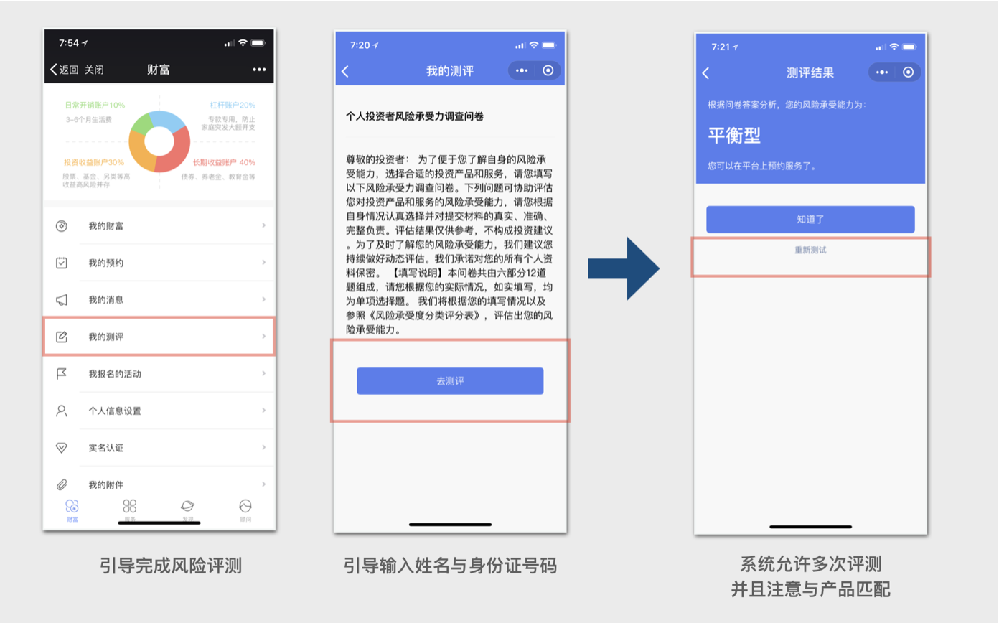

# 存续客户查看与预约





### 定义：存续客户定义与分类

* 事实存续客户定义:  _**目前系统仅导入截至3.30 ，仍在存续期金融资产的客户（暂不含保险产品）**_
* 事实存续客户分类：

> * 专业投资者认定  （有
> * 普通投资者认定 （仅发生保险或者泰通类资产交易，尚未经过专业投资者认定客户）

**具体认定，可以在理财师APP，客户列表中查询**

如果客户注册的手机号码与系统登录手机号码不一致，通过则无法通过实名认证，即无法获得已经购买的资产数据。在正式运营之后，允许客户通过实名认证替代原有资产

### STEP 1 邀请存续客户查看资产功能 {#step-1}

1. RM打开投资人端小程序

   

2. 分享小程序给到客户

   

3. 引导客户打开小程序链接并进行登录

   

4. 用户登录后查看存续资产

   

   

### STEP 2 普通投资者存续客户预约 {#step-2}


按照以上步骤，引导客户查看资产，浏览产品基础功能之后，进行预约交易，需要确认客户状态

* 状态为“专业投资者”认定 客户，可以直接至STEP3 ，在理财师APP发起预约交易
* 状态为“普通投资者”认定 客户， 需要补充完成风险评测

本部分只针对普通投资者认定


1. 查看客户认定状态

   

2. 引导客户进行普通投资者进行风险评测

   

### STEP 3 　预约产品（理财师APP） {#step-3-app}

[同新客户注册与预约 相应部分](https://alego.gitbook.io/acfhandbook/~/edit/primary/cai-yi-45-yue-ce-shi-liu-cheng/untitled-1#step4-.-app) 点击此处 查看  

